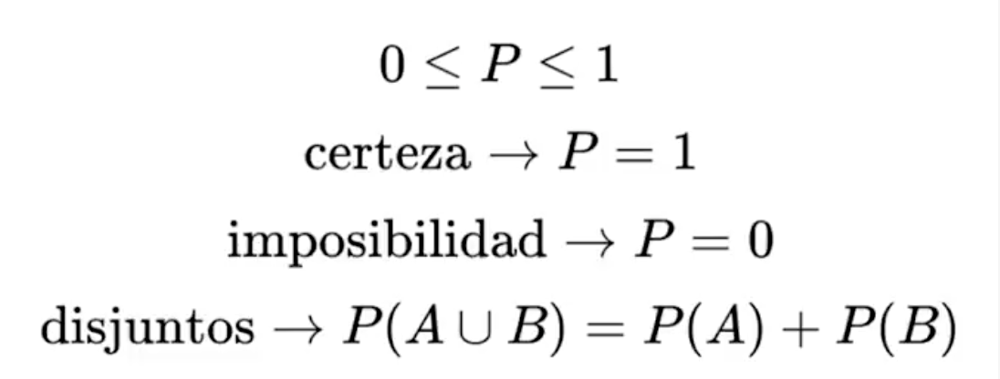
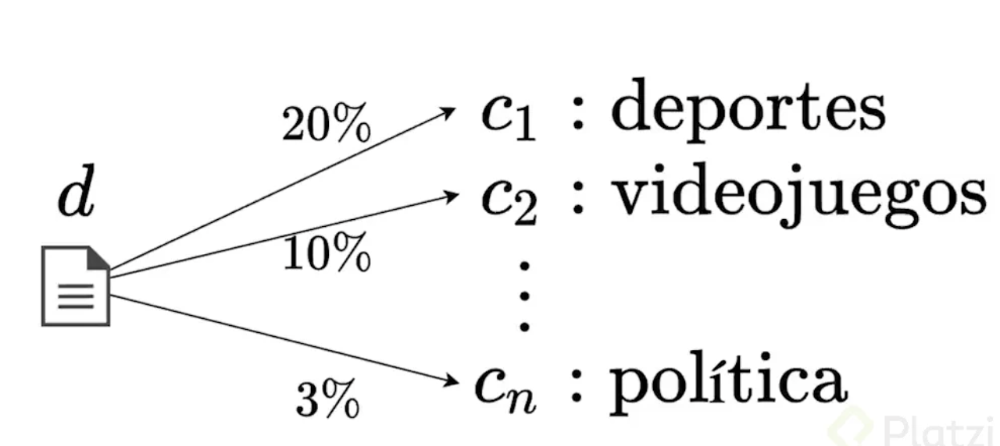
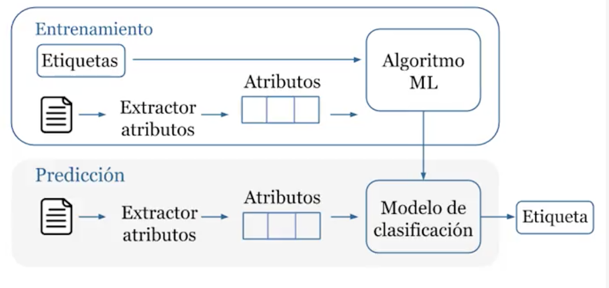
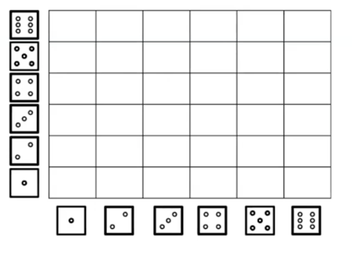

# Probabilidad

## Qué es la probabilidad

Es un lenguaje que nos da herramientas para cuantificar la incertidumbre. 

### Axiomas de probabilidad

Los axiomas son un conjunto de sentencias que no son derivables de algo más fundamental, y por lo tanto, se les puede dar por verdad y no requieren demostración. 

Los axiomas de probabilidad son las condiciones mínimas que deben verificarse para que una función definida sobre un conjunto de sucesos determine consistentemente sus probabilidades.

La probabilidad está dada por el número de casos de éxito sobre la cantidad total(teórica) de casos:

$$P = {(numSucesosExitosos) \over (numSucesosTotales)}$$

- Suceso elemental: Es una única ocurrencia. 
- Sucesos: Posibilidades que tenemos en el sistema. Compuesto por sucesos elementales.

De la interpretación del axioma, divergen dos escuelas de pensamiento: **Frecuentista** y **Bayesiano**. 

- **Escuela Frecuentista**: Los números que llamamos probabilidades son números que sólo se alcanzan una vez que se hacen infinitos lanzamientos. Como por ejemplo, lanzar una moneda y ver si sale cara o sello. Una vez que se hacen infinitos lanzamientos de la moneda, la proporción entre número de sucesos exitosos y totales tiende a 1/2.

- **Escuela Bayesiana**: 

Las propiedades que deben cumplirse:

- Números del 0 al 100%, del 0 al 1.
- Un evento totalmente certero con probabilidad igual a 1
- Un evento imposible es probabilidad igual a cero.
- Si tengo elementos disyuntos, por ejemplo un dado que caiga en 2 o en 4. Son eventos disyuntos, por lo que se suman las probabilidades. En este ejemplo, 2/6.

## Probabilidad en Machine Learning

Si la probabilidad es conjunto de herramientas y un lenguaje que permite cuantificar la incertidumbre. En Machine Learning las fuentes de incertidumbre son:

- **Datos**: Recoger datos es un proceso imperfecto.
- **Atributos del modelo**: Un modelo se alimenta con atributos, un subconjunto reducido de toda la realidad del problema que se quiere aplicar un modelo.
- **Arquitectura del modelo**: Una representación simplificada de la realidad, e introduce otra capa de incertidumbre.

Por ejemplo en un modelo de clasificación:

## Tipos de probabilidad

Tomemos un ejemplo de lanzamiento de dos dados:

 - **Conjunta (joint)**: Cuando calculo la probabilidad de 2 o más sucesos, eso se le llama probabilidad conjunta. Ejemplo: Probabilidad de que al lanzar dos dados, ambos caigan en número par: 9/36, ó 1/4
 - **Marginal**: Probabilidad sencilla a partir de una probabilidad conjunta. Se obtienen haciendo sumas sobre ciertas variables aleatorias o ciertas ocurrencias dentro de la probabilidad conjunta. Siempre que se haga sumas de probabilidades conjuntas y se deje libre una variable, se dice que se está obteniendo la probabilidad marginal de esa variable que queda libre.
 - **Condicional**: P(A=par | B=par). Ahora, si quiero calcular, por ejemplo, la probabilidad de que A caiga en par, dado que B ya cayó en par, estamos hablando de probabilidad condicional, y cambia un poco los resultados, si hay un total de 36 opciones que pueden darse debido a que cada dado tiene 6 caras, si B ya cayó en par, reduzco esas probabilidades a 18. El número de eventos exitosos no cambió, sino el número de eventos posibles. Por lo tanto, ahora las posibilidades son 9/18 ó 1/2

### Regla del Producto

$$P(A,B) = {P(A | B)*P(B)}$$

Se usa para descomponer en general, probabilidades condicionales.
